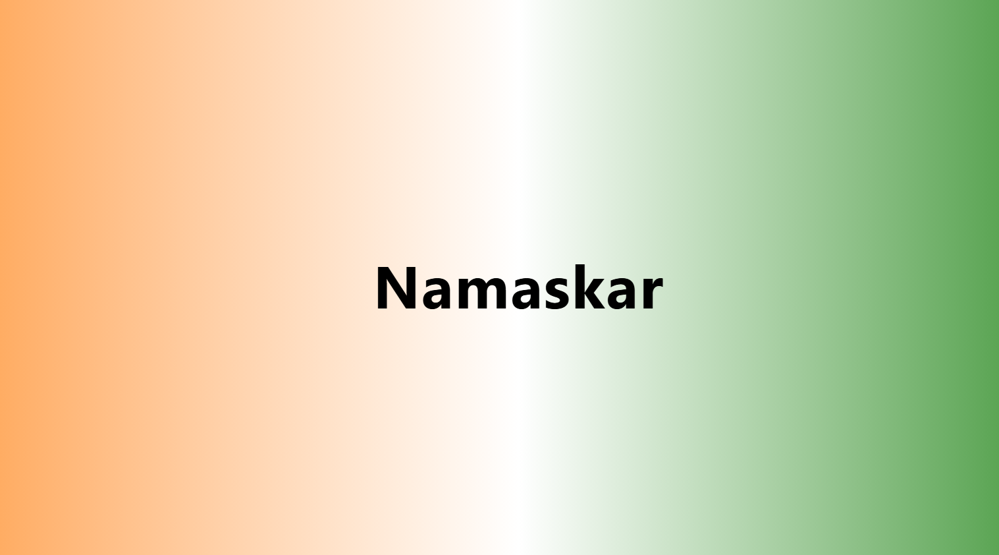
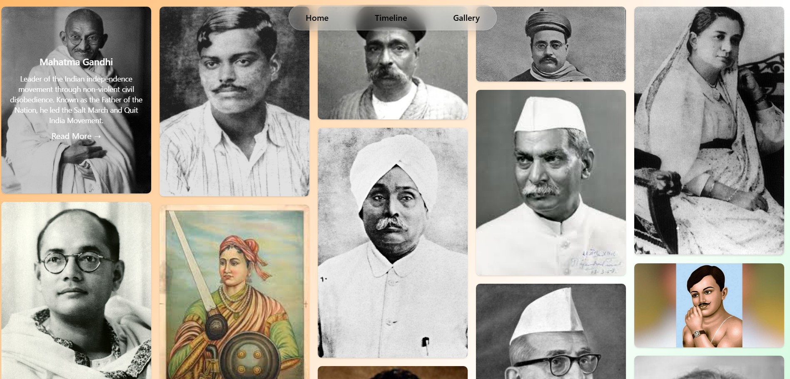
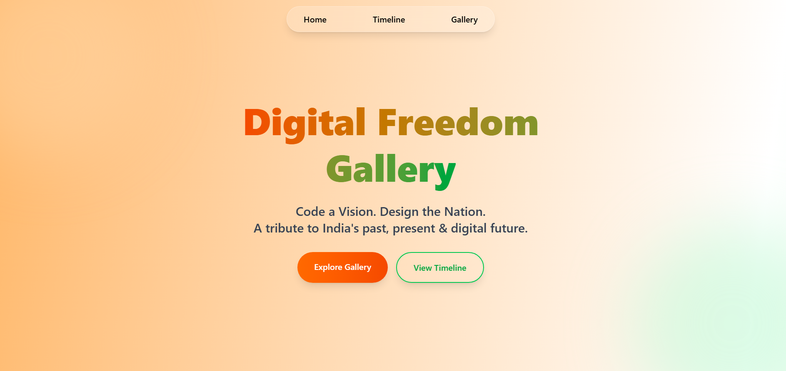
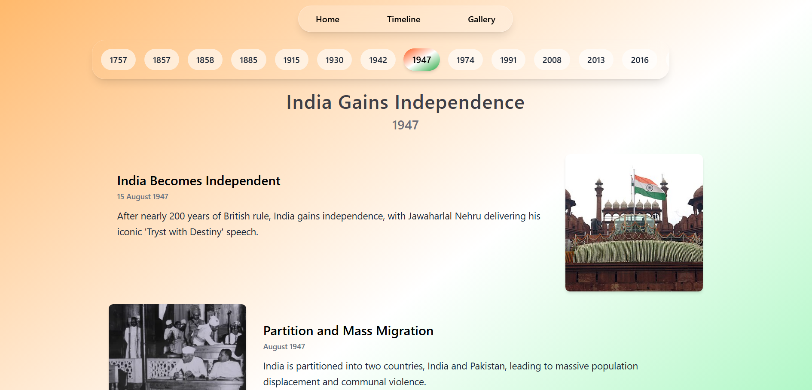
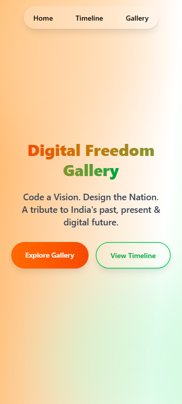
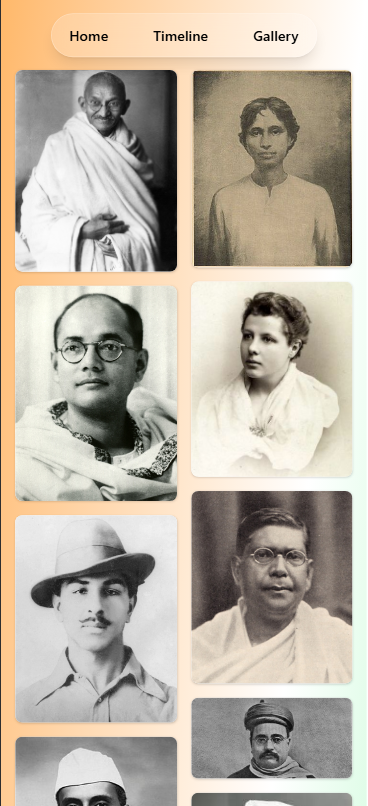
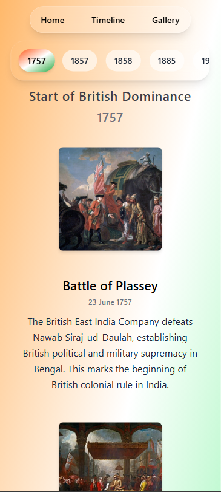

# 🇮🇳 Digital Freedom Gallery

> **Code a Vision. Design the Nation.**

A modern, interactive tribute to India's freedom fighters and historical journey from ancient times to the digital future. Built with React and powered by smooth animations, this gallery celebrates India's rich heritage while envisioning its technological tomorrow.

[](https://digital-freedom-gallery.vercel.app/)
[](https://github.com/CSShubham/Digital_Freedom_Gallery)

## ✨ Features

### 🎨 **Interactive Gallery**
- **Masonry Layout**: Beautiful Pinterest-style grid showcasing freedom fighters
- **Hover Effects**: Smooth animations revealing detailed information about each hero
- **Responsive Design**: Optimized for all devices from mobile to desktop
- **Direct Links**: Quick access to Wikipedia articles for deeper learning

### 📅 **Historical Timeline**
- **Interactive Navigation**: Smooth transitions between different eras
- **Rich Content**: Detailed events with historical images and descriptions
- **Horizontal Scroll**: Innovative timeline experience with GSAP animations
- **Era Categories**: Organized by Colonial Era, Freedom Struggle, and more

### 🚀 **Modern Experience**
- **Loading Animation**: Multi-language greeting system showcasing India's diversity
- **Smooth Animations**: GSAP-powered transitions and scroll-triggered effects
- **Gradient Design**: Tri-color inspired theme throughout the application
- **Performance Optimized**: Fast loading with lazy-loaded images

## 🛠️ Tech Stack

| Technology | Purpose | Version |
|------------|---------|---------|
| **React** | Frontend Framework | ^19.1.1 |
| **Vite** | Build Tool & Dev Server | ^7.1.2 |
| **GSAP** | Animations & Scroll Effects | ^3.13.0 |
| **Tailwind CSS** | Styling & Responsive Design | ^4.1.12 |
| **React Router** | Navigation & Routing | ^7.8.0 |

## 🚀 Quick Start

### Prerequisites
- Node.js (v16 or higher)
- npm or yarn package manager

### Installation

1. **Clone the repository**
   ```bash
   git clone https://github.com/CSShubham/Digital_Freedom_Gallery.git
   cd Digital_Freedom_Gallery
   ```

2. **Install dependencies**
   ```bash
   npm install
   ```

3. **Start development server**
   ```bash
   npm run dev
   ```

4. **Open your browser**
   ```
   http://localhost:5173
   ```

## 📂 Project Structure

```
Digital_Freedom_Gallery/
├── public/
│   ├── gallary.json          # Freedom fighters data
│   ├── timelineData.json     # Historical timeline data
│   └── vite.svg
├── src/
│   ├── components/
│   │   ├── Gallary.jsx       # Gallery component with masonry layout
│   │   ├── Home.jsx          # Landing page with hero section
│   │   ├── Loading.jsx       # Multi-language loading screen
│   │   ├── Nav.jsx           # Navigation component
│   │   ├── ScrollMockup.jsx  # Horizontal scroll timeline
│   │   ├── Timeline.jsx      # Timeline navigation
│   │   └── TimelineDetails.jsx # Individual timeline event details
│   ├── contexts/
│   │   └── DataContext.jsx   # Global state management
│   ├── App.jsx               # Main application component
│   ├── main.jsx              # Application entry point
│   └── index.css             # Global styles
├── package.json
└── vite.config.js
```

## 🎯 Key Components

### 🖼️ **Gallery Component**
- Displays 28 freedom fighters in an elegant masonry layout
- Interactive hover states with biographical information
- Responsive columns that adapt to screen size
- Direct Wikipedia integration for extended learning

### 📜 **Timeline System**
- Covers major historical periods from 1757 to 2047
- Interactive navigation between different eras
- Rich multimedia content with historical images
- Future vision extending to India's centenary of independence

### 🎨 **Scroll Experience**
- Horizontal scrolling timeline powered by GSAP ScrollTrigger
- 8 distinct sections showcasing India's journey
- Smooth animations and scroll-synchronized effects
- Mobile-responsive with optimized touch interactions

## 📸 Screenshots

<details>
<summary>🖼️ <strong>Click to view application screenshots</strong></summary>

### 🏠 Landing Page

*Hero section with animated greeting and navigation*

### 🎨 Gallery View

*Masonry layout showcasing freedom fighters with hover effects*

### 🏠 Home Page

*Interactive Home page with navigation*

### 📜 Timeline Details

*Detailed historical events with images and descriptions*

### 📱 Mobile Experience
<div style="display: flex; gap: 20px;">
  
  
  
</div>

  

</details>

## 🌟 Highlights

### **Historical Coverage**
- **Colonial Era**: British dominance and early resistance
- **Freedom Struggle**: Independence movements and key battles
- **Modern India**: Post-independence achievements and digital transformation
- **Future Vision**: Technological advancement and space exploration goals

### **Featured Freedom Fighters**
- Mahatma Gandhi, Subhas Chandra Bose, Bhagat Singh
- Rani Lakshmibai, Chandrashekhar Azad, Sarojini Naidu
- Dr. B.R. Ambedkar, Sardar Vallabhbhai Patel
- And many more heroes who shaped modern India

### **Timeline Milestones**
- 1757: Battle of Plassey
- 1857: First War of Independence
- 1947: India's Independence
- 2008: Chandrayaan-1 Mission
- 2030: Mars colonization vision
- 2047: Centenary celebration

## 📱 Responsive Design

The application is fully responsive across all devices:

- **Desktop**: Full-featured experience with advanced animations
- **Tablet**: Optimized layout with touch-friendly navigation
- **Mobile**: Streamlined interface with essential features
- **Touch Devices**: Smooth scroll and gesture support

## 🚀 Available Scripts

```bash
# Development
npm run dev          # Start development server

# Build
npm run build        # Create production build
npm run preview      # Preview production build locally

# Code Quality
npm run lint         # Run ESLint for code quality checks
```

## 🎨 Design Philosophy

The design draws inspiration from India's national colors and cultural heritage:

- **Saffron (#FF9933)**: Representing courage and sacrifice
- **White**: Symbolizing truth and peace
- **Green (#138808)**: Denoting prosperity and growth
- **Modern Gradients**: Blending tradition with contemporary design

## 🤝 Contributing

We welcome contributions to make this tribute even better! Here's how you can help:

1. **Fork the repository**
2. **Create a feature branch**: `git checkout -b feature/amazing-feature`
3. **Commit changes**: `git commit -m 'Add amazing feature'`
4. **Push to branch**: `git push origin feature/amazing-feature`
5. **Open a Pull Request**

### Areas for Contribution
- Add more freedom fighters to the gallery
- Extend timeline with additional historical events
- Improve accessibility features
- Add more language support
- Enhance mobile experience

## 📄 License

This project is licensed under the MIT License - see the [LICENSE](LICENSE) file for details.

## 👨‍💻 Author

**Shubham** - [GitHub Profile](https://github.com/CSShubham)

## 🙏 Acknowledgments

- **Freedom Fighters**: For their sacrifices that made modern India possible
- **Historical Sources**: Wikipedia and various historical archives
- **Image Credits**: Wikimedia Commons and public domain sources
- **Inspiration**: India's rich heritage and bright digital future

---

<div align="center">

**"Freedom is not worth having if it does not include the freedom to make mistakes."**
*- Mahatma Gandhi*

**Made with ❤️ for India's Digital Future**

</div>
